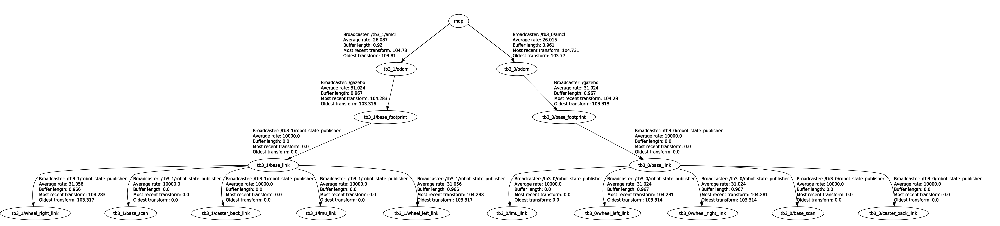

# ROS-Based Simulated Multi-Robot Systems
This repository contains resources for the simulation of ROS-Based Multi-Robot Systems. The implementations are based on ROS and MORSE or Gazebo for simulation. Aside from simply running the uses cases, they can be modified to any extent for individual purposes.
There are two use cases in this repository:
- The Multi-Robot Exploration Use Case [1,2]  
   In this scenario two robots have to explore an unknown environment and provide a map of it. Localization and mapping are based on the SLAM algorithm. Each robot maintains an own map and shares it with the other robot. The map from the other map is merged into the own map. With this new map frontiers are determined (frontier-based exploration) to which the robot navigates to further explore the environment. This use case is only implemented in __MORSE__.
- The Multi-Robot Cleaning Use Case [3]  
   In this use case two robots have to clean a given set of locations of a known environment. Localization is based on AMCL. Each robot traverses an individual sequence of destinations (no actual cleaning operation is simulated). This use case is implemented both in __MORSE__ and __Gazebo__.

Both use cases were run on Ubuntu 18.04 with ROS Melodic, MORSE(1.4.2) and Gazebo(9.0.0) respectively. For simulation in MORSE two Pioneer 3-DX are used, whereas two Turtlebot3 Burger are simulated in Gazebo. The environments in MORSE and Gazebo are identical but the one in Gazebo is downsized by a factor of four. Environment and robots can be replaced by other models - some ROS nodes' parameters may have to be adapted accordingly. Switching to another ROS version like Kinetic should work, but was not tested.

If you are familiar with ROS and MORSE/Gazebo, you may want to skip to the [installation instructions for the required ROS packages](#installing-the-required-packages) or to [the section on how to run the use cases](#running-the-use-cases).

# Prerequisites
Before setting up and running the use cases make sure that:  
- __ROS__ is installed and running properly. For the installation of ROS stick to the [official installation instructions](http://wiki.ros.org/melodic/Installation/Ubuntu). Pick the desktop-full or desktop installation. The desktop-full installation should come with Gazebo.
- __MORSE__ and the required ROS dependencies are installed. Follow the [official installation instructions](https://www.openrobots.org/morse/doc/stable/user/installation.html).  
   Important: To interface with ROS, MORSE requires some [particular packages](http://www.openrobots.org/morse/doc/1.3/user/installation/mw/ros.html). Sometimes these packages are falsely removed by apt-get autoremove and it might be necessary to reinstall them: `python3-rospkg`, `python3-catkin-tools` (and `python3-catkin-tools`) and `python3-yaml` (and `ros-melodic-rospy`) - all available via apt for Ubuntu 18.04.  
- __Gazebo__ and the required ROS dependencies work.  
   If you installed the desktop-full version of ROS, Gazebo is probably installed as well. If this is not the case, follow the [official documentation](http://gazebosim.org/tutorials?tut=ros_installing&cat=connect_ros).  
   __Important__: We will need some ROS plugins in the Gazebo models, which is why we need the [corresponding ROS package](http://wiki.ros.org/gazebo_plugins): `sudo apt install ros-melodic-gazebo-plugins`.

Now ROS and the simulators should be ready. If you just want to run a single simulator you don't have to install the other one. Before continuing make sure that these components are properly installed (Can you start ROS and the simulator? Does the simulator publish ROS messages for a ROS-based simulation? Are there any warnings or errors?).

# Setting up the Use Cases

The use cases depend on several ROS packages.  
For the Multi-Robot-Exploration:  
- morse\_internals_publisher (optional)  
- explore\_multirobot  
- robot\_pose\_publisher  
- map\_merging  
- exploration\_monitor  
- gmapping  
- ROS navigation stack (Melodic Version)  

For the Multi-Robot-Cleaning Use Case:  
- goal\_provider  
- map\_server  
- turtlebot3  
- ROS navigation stack (Kinetic release)  
- exploration\_monitor and morse\_internals\_publisher (optional)  

The optional packages are not necessarily needed for the functionality of the use cases but still installed. The two use cases rely on different packages. An important difference is that the multi-robot exploration use case needs the Melodic version of the navigation stack (to be precise of the costmap2D package), whereas the the multi-robot cleaning use case runs with the Kinetic version of the navigation stack - as we could observe an unexpected behavior when running it with the Melodic version. For this reason we recommend to only install the packages for the use case of interest, otherwise close attention has to be paid to sourcing the correct environment.
We need to create a catkin workspace and build several of the packages from source. Some of the packages are part of meta-packages. The following section guides through the process of creating the workspace for the packages and installing them.

## Installing the required packages

1. If the environment hasn't been sourced yet: `source /opt/ros/melodic/setup.bash`
2. Create a catkin workspace e.g.: `~/catkin_ws` with a src directory `~/catkin_ws/src` (or just run : `mkdir -p ~/catkin_ws/src`)
3. In `~/catkin_ws` run `catkin_make`
4. Run `source devel/setup.bash`
5. Get the necessary packages. Switch to the corresponding directory `cd ~/catkin_ws/src` and get the source code for the packages:
  - For the __multi-robot exploration__ use case:  
     - Get the ROS navigation stack: `sudo apt-get install ros-melodic-navigation`
      - Get the required packages for SLAM:
         `git clone https://github.com/ros-perception/openslam_gmapping.git`
         `git clone https://github.com/ros-perception/slam_gmapping.git`
       - Get the remaining packages:
          - Clone the mrs_exploration repository
          - Clone the mrs_packages repository
  - For the __multi-robot cleaning__ use case:
     - Get the Kinetic release of the navigation stack; you can either clone the repository and checkout the Kinetic release with `git clone https://github.com/ros-planning/navigation.git && git checkout kinetic-devel && git checkout tags/1.14.4 -b most-recent-kinetic-release` or you just [download the zipped files](https://github.com/ros-planning/navigation/archive/1.14.4.zip) and unpack them. In both cases we have to make a little change to `amcl/src/amcl_node.cpp` to build for Melodic, the adaption is explained [here](https://github.com/moriarty/navigation/commit/ae060c92a423783c45ef35005ec443e5736c6689).
     - Get the Turtlebot resources: `git clone https://github.com/ROBOTIS-GIT/turtlebot3.git`
     - Clone the the mrs_packages repository
6. Now we have all the required packages; go back to the root of your catkin workspace: `cd ~/catkin_ws`
7. Get all packages' dependencies: `rosdep install --from-paths src --ignore-src --rosdistro melodic -r -y`
8. Build all our packages: `catkin_make -DCMAKE_BUILD_TYPE=Release`. This might take a few minutes the first time and depending on the system.
9. Et voilà: All packages are available. Keep in mind that you have to source them: `source ~/catkin_ws/devel/setup.bash`. You can list all available ROS packages with the command `rospack list-names`.

Now we can finally proceed to launch the simulations.

# Running the Use Cases
We can differ between two steps for all of the presented use cases:  

1. Launching the simulation  
   For MORSE-based simulations: `morse run simulation_file.py` (with a running ROS Master)  
   Gazebo-based simulations can be started from a launch file: `roslaunch gazebo_simulation.launch`  
2. Launching  the robots' ROS nodes  
   Start everything from the corresponding launch file: `roslaunch launch_file.launch`

In this repository, go to the directory of the use case you want to launch.

Multi-Robot-Cleaning in __MORSE__:  
1. Start ROS: `roscore`  
2. Start simulation: `morse run simulation_multi_robot.py`  
3. Start ROS nodes: `roslaunch multi_robot.launch` - if you did not run `roscore` before, a ROS master is launched as well.  

Multi-Robot-Cleaning in __Gazebo__:  
1. Specify the Turtlebot 3 model once in both terminals: `export TURTLEBOT3_MODEL=burger`  
2. `roslaunch simulation_multi_robot.launch`  
3. `roslaunch multi_robot_launch.launch`  

Multi-Robot Exploration in MORSE:  
1. `roscore`  
2. `morse run simulation_multi_robot.py`  
3. `roslaunch multi_robot.launch`

__IMPORTANT__: You need to source the ROS and catkin setup files (in each terminal window). If you followed the standard ROS configuration, you already added the command (`source /opt/ros/melodic/setup.bash`) to your .bashrc and only have to `source ~/catkin_ws/devel/setup.bash`. 

# Use Case Details
Depending on the use case the overall architecture is slightly different. The following figure wraps up the high-level architecture for the use cases:

  

As there are two robots, topics and nodes have to be associated to the namespace of the corresponding robot. Same applies to the transforms. The ROS nodes running for both robots are identical, since they perform the same tasks. The subsequent transform tree and ROS computation graph for the respective use cases depict the detailed structure of the implementations. 

Multi-Robot Cleaning Use Case in <b>Gazebo</b> 
  

ROS computation graph:  

  

ROS transform tree:  

Multi-Robot Cleaning Use Case in <b>MORSE</b> 
  

ROS computation graph:  

  

ROS transform tree:  

  

As already pointed out, this use case relies on the Kinetic version of the ROS navigation stack, as some issues arise when using a realistic laser frequency (5 Hz) for the Turtlebot in combination with the Melodic version of the navigation stack. With the Kinetic version this issue could not be observed. For more details check out this [question on ROS answers](https://answers.ros.org/question/308814/costmap2d-observation-layers-laser-scan-callback-is-never-called-with-a-low-publication-rate/) and this [issue on Github](https://github.com/ROBOTIS-GIT/turtlebot3/issues/349).

Multi-Robot Exploration Use Case 
  

ROS computation graph:  

  

ROS transform tree:  

  
Parameters can be changed in the YAML files and/or directly in the launch files. Furthermore, simulation environment, robots, etc. can be easily changed as well in the corresponding simulation files.

# Troubleshooting
There are various sources for problems or issues that can cause a ROS-based system to run not as intended or even not at all. With numerous parameters, many nodes and interconnections between them it can be quite hard to find the actual soure of the problem. Before debugging there are some basic steps which can be taken to find or at least narrow down the origin of the issue. The following list is a (non-exhaustive) compilation of steps and aspects to consider which may be helpful. Depending on the type of failure they are more or less relevant.

- Are the relevant topics advertised? See `rostopic list` for all topics. Get infos on a particular node with `rosnode info node_name`.
- With [rqt](http://wiki.ros.org/rqt)  (`rqt_graph`) you can visualize the ROS computation graph. Are all nodes up and publishing/subscribed to the correct topics?
- Are the messages actually published to a topic? Just run `rostopic echo /topic_name` to print the actual messages.
- Are the publication frequency for a message and the delays as expected? With `rostopic hz /topic_name` you can get the publication frequency and with `rostopic delay /topic_name` the delay of the messages published to the specified topic.
- By setting `rosparam set enable_statistics true` additional statistics are published - and visualized in the rqt's computation graph.
- If you use a simulation time or suspect that timing is an issue, you can check out the timestamps of the published messages.
- Are the parameter values provided to the ROS parameter server as expected? All available parameters are displayed when running `rosparam list` - also pay attention to typos. The value of a parameter is returned by running `rosparam get /parameter_name`.
- If the transforms seem not to work properly, first check the corresponding [transform tree](http://wiki.ros.org/rqt_tf_tree): `rosrun rqt_tf_tree rqt_tf_tree` (or select the tf_tree plugin in the rqt GUI).
- By running `roswtf` the running ROS system is diagnosed for errors. The [tool](http://wiki.ros.org/roswtf) returns warnings and suspected errors.
- If you need more detailed information on the transforms, the [tf debugging tools](http://wiki.ros.org/tf/Debugging%20tools) can be helpful.
- The visualization of the messages in [rviz](http://wiki.ros.org/rviz) can be an easy way to spot problems concerning the messages' content. For instance, if a map contains falsely marked obstacle or does not allign to the sensor readings (do the sensor readings match the environment? - increase the decay time for a better overall picture). But keep in mind that rviz causes an additional load.
- Not sourcing the (correct) environment can be easily forgot.
- If you record all (or a relevant subset of) messages, you can inspect them in detail with rqt_bag: `rqt_bag recorded_bag.bag`. The messages can be published or played from the recorded bag too: `rosbag play recorded_bag.bag`.
- If you suspect that something is wrong with the simulation, only launch the simulation without the other nodes and inspect if the expected topics are advertised/subscribed and if the content of the messages is correct. Also check if the physical properties of the used models are correct.
- Does your machine present a bottleneck? If your system can barely keep up with the resource demand of the simulator and the ROS nodes, chances are high that you encounter some issues.

# Misc

- All ROS packages that are available as debian package can be simply installed via apt. The naming scheme follows the following pattern:`sudo apt-get install ros-<distro>-<package_name>`, so for Melodic: `sudo apt-get install ros-melodic-<package_name>`
- The [status page of the ROS packages](http://repositories.ros.org/status_page/ros_melodic_default.html) can be very handy to checkout the build status of a particular package or the exact version number.
- Just a single package can be built with `catkin_make -DCMAKE_BUILD_TYPE=Release --pkg [pkg_name]`
- If you start the ROS master manually, don't forget to shut it down after a run; otherwise, parameters from the previous run might interfere with the new one.
- [__rviz__](http://wiki.ros.org/rviz) is a great tool for visualization. You can visualize various message types like sensor readings, (cost)maps, transforms, poses, paths, etc. or publish navigation goals (by right-clicking the button in the GUI you can modify the topic to which the goal is published - for instance, for a particular robot in a multi-robot setup). You can launch rviz with an existing configuration by running `rviz -d some_rviz_file.rviz`.
- If you want to use simulation time (or any time that is provided by some node), you have to set `rosparam set use_sim_time true` and the time published to `/clock` is used instead of wall time.
- For refining the configuration of the navigation stack, the [tutorial on ROS.org](http://wiki.ros.org/navigation/Tutorials/RobotSetup) can be helpful - particularly when switching to a real robot. Some configuration steps are are more relevant for real systems.
- You can save a published map (for instance the one generated by a SLAM algorithm) with the map_saver of the [map_server](http://wiki.ros.org/map_server): `rosrun map_server map_saver map:=/map_topic`. Maps can be easily saved in a fixed interval: `for i in {1..12}; do rosrun map_server map_saver map:=/map_topic -f "map_name_$i" && sleep 5.0; done`.
- Launching a map_server that provides a map (read from a pgm and corresponding yaml file), can be achieved with the following command: `rosrun map_server map_server /COMPLETE_PATH/demo_map.yaml map:=/reference_map/map`
- For MORSE: You can simply interact with the simulator via [RPCs that can be called via Python](https://www.openrobots.org/morse/doc/latest/user/supervision_services.html). 

For instance, you can make the two robots in the simulation invisible (optically).
 <pre><code>
import pymorse
with pymorse.Morse() as sim:
    sim.rpc('simulation','set_object_visibility', 'p3dx0',0,1)
    sim.rpc('simulation','set_object_visibility', 'Wheel_L',0,1)
    sim.rpc('simulation','set_object_visibility', 'Wheel_R',0,1)
    sim.rpc('simulation','set_object_visibility', 'CasterWheel',0,1)
    sim.rpc('simulation','set_object_visibility', 'p3dx1',0,1)
    sim.rpc('simulation','set_object_visibility', 'Wheel_L.001',0,1)
    sim.rpc('simulation','set_object_visibility', 'Wheel_R.001',0,1)
    sim.rpc('simulation','set_object_visibility', 'CasterWheel.001',0,1)
</code></pre>

- You can manually publish messages to any topic. For instance, instead of publishing a goal via the rviz GUI you can publish a goal to the goal topic with `rostopic pub --once p3dx0/move_base_simple/goal geometry_msgs/PoseStamped '{header: {stamp: now, frame_id: "p3dx0_tf/map"}, pose: {position: {x: 2.0, y: -20.0, z: 0.0}, orientation: {w: 1.0}}}'` (adapt the topics and frames according to your setup).
- You can run your simulation in headless mode. This is convenient if a visual representation of the simulation isn't required. However, in MORSE this also means that there is no hardware acceleration. MORSE [still needs](https://www.openrobots.org/morse/doc/latest/headless.html) OpenGL, so in headless mode the OpenGL calls are processed by the CPU and not the GPU. For hardware acceleration in headless mode you would have to set up [XDummy](http://xpra.org/trac/wiki/Xdummy) and VirtualGL. The headless mode of Gazebo has a better support. In any case, first starting with the rendered simulation (and a system that is strong enough) and then switching to headless mode can be recommended.
- Sometimes Gazebo crashes on startup. This can be caused by a stuck simulation server. In this case running `killall gzserver` helps.

---

Use cases adopted from:  
[1] Yan, Z., Fabresse, L., Laval, J., & Bouraqadi, N. (2014, October). Team size optimization for multi-robot exploration. In International Conference on Simulation, Modeling, and Programming for Autonomous Robots (pp. 438-449). Springer, Cham.  
[2] Yan, Z., Fabresse, L., Laval, J., & Bouraqadi, N. (2017). Building a ROS-Based Testbed for Realistic Multi-Robot Simulation: Taking the Exploration as an Example. robotics, 6(3), 21  
[3] Matena, V., Bures, T., Gerostathopoulos, I., & Hnetynka, P. (2016, May). Model problem and testbed for experiments with adaptation in smart cyber-physical systems. In Software Engineering for Adaptive and Self-Managing Systems (SEAMS), 2016 IEEE/ACM 11th International Symposium on (pp. 82-88). IEEE.
